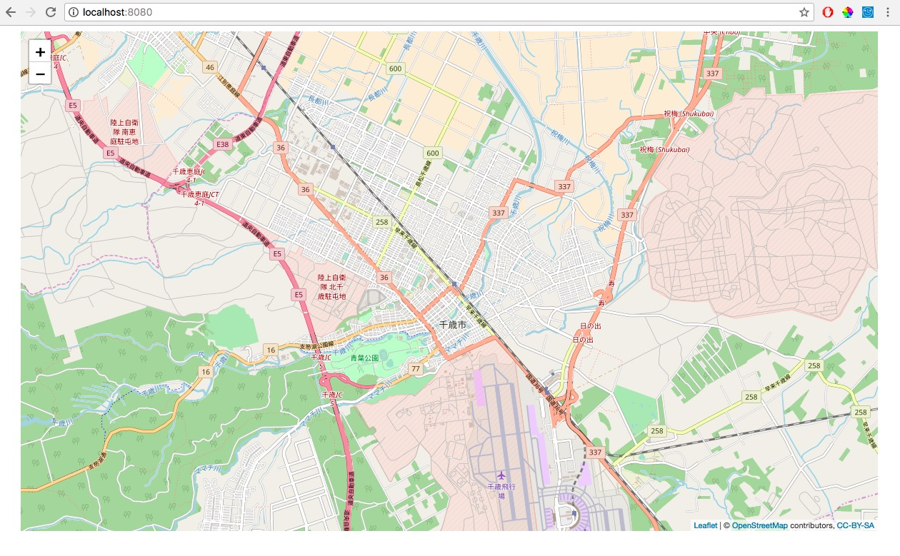

### 1.Leafletで地図を表示してみる

`java/page`パッケージに以下のファイルを作る 

HomePage.html
```html
<!DOCTYPE html>
<html xmlns:wicket="http:/wicket.apache.org">
<head>
    <meta charset="UTF-8"/>
    <title>MapPage</title>
</head>
<body>
    <div style="width: 1400px;height: 700px;" id="map"></div>
</body>
</html>

```

HomePage.java
```java
package page;

import de.agilecoders.wicket.webjars.request.resource.WebjarsCssResourceReference;
import de.agilecoders.wicket.webjars.request.resource.WebjarsJavaScriptResourceReference;
import org.apache.wicket.markup.head.CssHeaderItem;
import org.apache.wicket.markup.head.IHeaderResponse;
import org.apache.wicket.markup.head.JavaScriptHeaderItem;
import org.apache.wicket.markup.head.OnDomReadyHeaderItem;
import org.apache.wicket.markup.html.WebPage;

public class HomePage extends WebPage {
    @Override
    public void renderHead(IHeaderResponse response) {
        super.renderHead(response);
        response.render(JavaScriptHeaderItem.forReference(getApplication().getJavaScriptLibrarySettings().getJQueryReference()));
        //Leafletの読み込み
        response.render(JavaScriptHeaderItem.forReference(new WebjarsJavaScriptResourceReference("./leaflet/current/dist/leaflet.js")));
        response.render(CssHeaderItem.forReference(new WebjarsCssResourceReference("./leaflet/current/dist/leaflet.css")));
        //作成したjsファイルの読み込み
        response.render(JavaScriptHeaderItem.forUrl("./js/map.js"));
        //ページ表示時にjavascriptの関数を実行する
        response.render(OnDomReadyHeaderItem.forScript("drawMap();"));
    }
}

```

`webapp/js`パッケージを作成し以下のファイルを作る

```javascript
var map;
var tileLayer;
var staticLat = 42.828816;
var staticLon = 141.650705;

function drawMap() {
    //地図の初期表示座標とズーム度を設定
    map = L.map('map').setView([staticLat, staticLon], 13);

    //実際に表示するタイルデータを取得
    tileLayer = L.tileLayer('https://{s}.tile.openstreetmap.org/{z}/{x}/{y}.png', {
        attribution: '© <a href="http://osm.org/copyright">OpenStreetMap</a> contributors, <a href="http://creativecommons.org/licenses/by-sa/2.0/">CC-BY-SA</a>',
        maxZoom: 19
    });
    //地図にタイルデータを追加
    tileLayer.addTo(map);
}
```

**実行結果**


[ハンズオン2へ](HandsOn02.md)