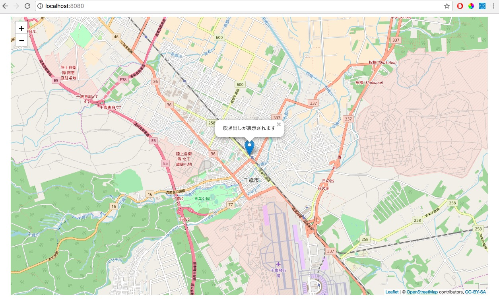

2.Leafletで地図にピン(吹き出し付き)を出してみる

`webapp/js`以下に作成したmap.jsを変更する

```javascript
var map;
var tileLayer;
var marker;
var staticLat = 42.828816;
var staticLon = 141.650705;

function drawMap() {
    map = L.map('map').setView([staticLat, staticLon], 13);

    tileLayer = L.tileLayer('https://{s}.tile.openstreetmap.org/{z}/{x}/{y}.png', {
        attribution: '© <a href="http://osm.org/copyright">OpenStreetMap</a> contributors, <a href="http://creativecommons.org/licenses/by-sa/2.0/">CC-BY-SA</a>',
        maxZoom: 19
    });
    tileLayer.addTo(map);
    
    //追加
    setMarker();

} 

function setMarker(){
    //第1引数に座標の配列, 第2引数にオプションの設定(markerの色,形など)
    marker = L.marker([staticLat, staticLon], {}).addTo(map).bindPopup('吹き出しが表示されます');
}
```

**実行結果**


[ハンズオン3へ](./HandsOn03.md)