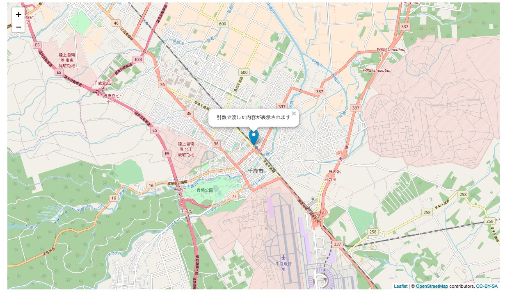

3.引数付きのjavascriptの関数をJavaから実行してみる

`java/page`に作成したHomePage.javaを以下のように変更

```java
package page;

import de.agilecoders.wicket.webjars.request.resource.WebjarsCssResourceReference;
import de.agilecoders.wicket.webjars.request.resource.WebjarsJavaScriptResourceReference;
import net.arnx.jsonic.JSON;
import org.apache.wicket.markup.head.CssHeaderItem;
import org.apache.wicket.markup.head.IHeaderResponse;
import org.apache.wicket.markup.head.JavaScriptHeaderItem;
import org.apache.wicket.markup.head.OnDomReadyHeaderItem;
import org.apache.wicket.markup.html.WebPage;

public class HomePage extends WebPage {
    @Override
    public void renderHead(IHeaderResponse response) {
        super.renderHead(response);
        response.render(JavaScriptHeaderItem.forReference(getApplication().getJavaScriptLibrarySettings().getJQueryReference()));
        response.render(JavaScriptHeaderItem.forReference(new WebjarsJavaScriptResourceReference("./leaflet/current/dist/leaflet.js")));
        response.render(CssHeaderItem.forReference(new WebjarsCssResourceReference("./leaflet/current/dist/leaflet.css")));
        response.render(JavaScriptHeaderItem.forUrl("./js/map.js"));
        //変更点:JSON.encode(javascriptの関数に渡したい)
        response.render(OnDomReadyHeaderItem.forScript("drawMap("+ JSON.encode("引数で渡した内容が表示されます") +");"));
    }
}
```

`webapp/js`に作成したmap.jsを以下のように変更

```javascript
var map;
var tileLayer;
var marker;
var staticLat = 42.828816;
var staticLon = 141.650705;

//引数を追加
function drawMap(hukidasi) {
    map = L.map('map').setView([staticLat, staticLon], 13);

    tileLayer = L.tileLayer('https://{s}.tile.openstreetmap.org/{z}/{x}/{y}.png', {
        attribution: '© <a href="http://osm.org/copyright">OpenStreetMap</a> contributors, <a href="http://creativecommons.org/licenses/by-sa/2.0/">CC-BY-SA</a>',
        maxZoom: 19
    });
    tileLayer.addTo(map);
    //引数を渡して関数呼び出し
    setMarker(hukidasi);
}
//引数を追加
function setMarker(hukidasi){
    marker = L.marker([staticLat, staticLon], {}).addTo(map).bindPopup(hukidasi);
}
```

**実行結果**


[ハンズオン4へ](./HandsOn04.md)