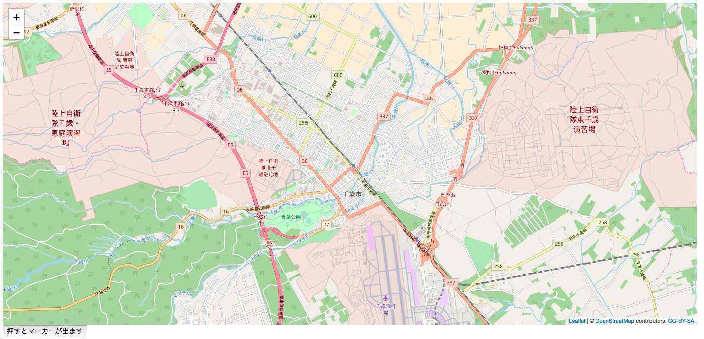

## 4.ボタンを押した時にjavascriptの関数を実行してみる

`java/page`に作成したHomePage.javaを以下のように変更

```java
package page;

import de.agilecoders.wicket.webjars.request.resource.WebjarsCssResourceReference;
import de.agilecoders.wicket.webjars.request.resource.WebjarsJavaScriptResourceReference;
import net.arnx.jsonic.JSON;
import org.apache.wicket.ajax.AjaxRequestTarget;
import org.apache.wicket.ajax.markup.html.AjaxLink;
import org.apache.wicket.markup.head.CssHeaderItem;
import org.apache.wicket.markup.head.IHeaderResponse;
import org.apache.wicket.markup.head.JavaScriptHeaderItem;
import org.apache.wicket.markup.head.OnDomReadyHeaderItem;
import org.apache.wicket.markup.html.WebPage;

public class HomePage extends WebPage {

    //追加
    public HomePage(){
        add(new AjaxLink<Void>("addMarker") {
            @Override
            public void onClick(AjaxRequestTarget target) {
                target.appendJavaScript("setMarker("+ JSON.encode("吹き出しの中身") +");");
            }
        });
    }

    @Override
    public void renderHead(IHeaderResponse response) {
        super.renderHead(response);
        response.render(JavaScriptHeaderItem.forReference(getApplication().getJavaScriptLibrarySettings().getJQueryReference()));
        response.render(JavaScriptHeaderItem.forReference(new WebjarsJavaScriptResourceReference("./leaflet/current/dist/leaflet.js")));
        response.render(CssHeaderItem.forReference(new WebjarsCssResourceReference("./leaflet/current/dist/leaflet.css")));
        response.render(JavaScriptHeaderItem.forUrl("./answer/HandsOn04.js"));
        //追加
        response.render(OnDomReadyHeaderItem.forScript("drawMap();"));
    }
}
```

`java/page`に作成したHomePage.htmlを以下のように変更

```html
<!DOCTYPE  html>
<html xmlns:wicket="http:/wicket.apache.org">
<head>
    <meta charset="UTF-8"/>
    <title>MapPage</title>
</head>
<body>
<div style="width: 1400px;height: 650px;" id="map"></div>
<!-- 追加 -->
<button type="submit" style="font-size: 14px;" wicket:id="addMarker">押すとマーカーが出ます</button>
</body>
</html>

```

`webapp/js`に作成したmap.jsを以下のように変更

```javascript
var map;
var tileLayer;
var marker;
var staticLat = 42.828816;
var staticLon = 141.650705;

//引数を削除
function drawMap() {
    map = L.map('map').setView([staticLat, staticLon], 13);

    tileLayer = L.tileLayer('https://{s}.tile.openstreetmap.org/{z}/{x}/{y}.png', {
        attribution: '© <a href="http://osm.org/copyright">OpenStreetMap</a> contributors, <a href="http://creativecommons.org/licenses/by-sa/2.0/">CC-BY-SA</a>',
        maxZoom: 19
    });
    tileLayer.addTo(map);
    //setMarkerの関数呼び出しを削除
}

function setMarker(hukidasi){
    marker = L.marker([staticLat, staticLon], {}).addTo(map).bindPopup(hukidasi);
}
```

**実行結果**


ボタンを押すと


[ハンズオン5へ](HandsOn05.md)