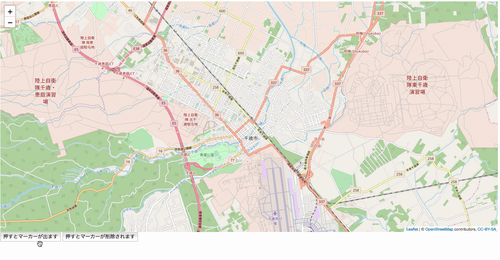

## 6.マーカーを複数設置してみる

`webapp/js`に作成したmap.jsを以下のように変更

```javascript
var map;
var tileLayer;
var marker;
var staticLat = 42.828816;
var staticLon = 141.650705;

function drawMap() {
    map = L.map('map').setView([staticLat, staticLon], 13);

    tileLayer = L.tileLayer('https://{s}.tile.openstreetmap.org/{z}/{x}/{y}.png', {
        attribution: '© <a href="http://osm.org/copyright">OpenStreetMap</a> contributors, <a href="http://creativecommons.org/licenses/by-sa/2.0/">CC-BY-SA</a>',
        maxZoom: 19
    });
    tileLayer.addTo(map);
    //
}

function setMarker(hukidasi){
    //変更
    for(var i=0;i<5;i++){
        marker = L.marker([staticLat+(i/150), staticLon+(i/150)], {}).addTo(map).bindPopup(hukidasi);
    }
}

function deleteMarker(){
    map.removeLayer(marker);
}
```

**実行結果**
