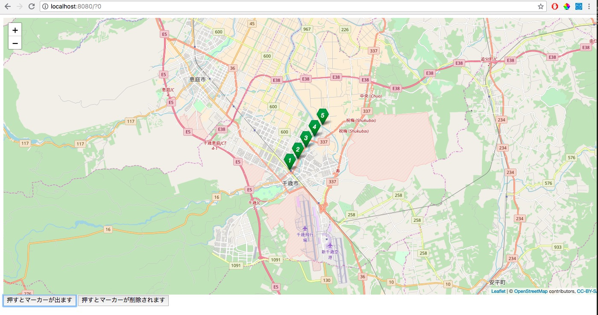

## 8.マーカーのデザインを変えてみる

civic-mapでは[Leaflet.ExtraMarkers](https://github.com/coryasilva/Leaflet.ExtraMarkers)という外部ライブラリを使ってマーカーに番号を振ったりデザインを変えたりしています


`java/page`に作成したHomePage.javaを以下のように変更

```java

import de.agilecoders.wicket.webjars.request.resource.WebjarsCssResourceReference;
import de.agilecoders.wicket.webjars.request.resource.WebjarsJavaScriptResourceReference;
import net.arnx.jsonic.JSON;
import org.apache.wicket.ajax.AjaxRequestTarget;
import org.apache.wicket.ajax.markup.html.AjaxLink;
import org.apache.wicket.markup.head.CssHeaderItem;
import org.apache.wicket.markup.head.IHeaderResponse;
import org.apache.wicket.markup.head.JavaScriptHeaderItem;
import org.apache.wicket.markup.head.OnDomReadyHeaderItem;
import org.apache.wicket.markup.html.WebPage;

public class HomePage extends WebPage {

    public HomePage(){
        add(new AjaxLink<Void>("addMarker") {
            @Override
            public void onClick(AjaxRequestTarget target) {
                target.appendJavaScript("setMarker("+ JSON.encode("吹き出しの中身") +");");
            }
        });

        add(new AjaxLink<Void>("deleteMarker") {
            @Override
            public void onClick(AjaxRequestTarget target) {
                target.appendJavaScript("deleteMarker();");
            }
        });
    }

    @Override
    public void renderHead(IHeaderResponse response) {
        super.renderHead(response);
        response.render(JavaScriptHeaderItem.forReference(getApplication().getJavaScriptLibrarySettings().getJQueryReference()));
        response.render(JavaScriptHeaderItem.forReference(new WebjarsJavaScriptResourceReference("./leaflet/current/dist/leaflet.js")));
        response.render(CssHeaderItem.forReference(new WebjarsCssResourceReference("./leaflet/current/dist/leaflet.css")));
        //以下の2行を追加
        response.render(JavaScriptHeaderItem.forUrl("./js/leaflet.extra-markers.min.js"));
        response.render(CssHeaderItem.forUrl("./css/leaflet.extra-markers.min.css"));

        response.render(JavaScriptHeaderItem.forUrl("./answer/HandsOn08.js"));
        response.render(OnDomReadyHeaderItem.forScript("drawMap();"));
    }
}
```

`webapp/js`に作成したmap.jsを以下のように変更

```javascript

var map;
var tileLayer;
var marker;
var markers = [];
var staticLat = 42.828816;
var staticLon = 141.650705;

function drawMap() {
    map = L.map('map').setView([staticLat, staticLon], 13);

    tileLayer = L.tileLayer('https://{s}.tile.openstreetmap.org/{z}/{x}/{y}.png', {
        attribution: '© <a href="http://osm.org/copyright">OpenStreetMap</a> contributors, <a href="http://creativecommons.org/licenses/by-sa/2.0/">CC-BY-SA</a>',
        maxZoom: 19
    });
    tileLayer.addTo(map);
    //
}

function setMarker(hukidasi) {
    markers=[];
    for (var i = 0; i < 5; i++) {
        marker = L.marker([staticLat + (i / 150), staticLon + (i / 150)],
            //追加
            {
                icon: L.ExtraMarkers.icon({
                    icon: 'fa-number',
                    shape: 'penta',
                    prefix: 'fa',
                    markerColor: 'green',
                    number: i + 1,
                })
            }).addTo(map).bindPopup(hukidasi);
        markers.push(marker);
    }
}

function deleteMarker() {
    for (var i = 0; i < 5; i++) {
        map.removeLayer(markers[i]);
    }
}
```
**実行結果**



[ハンズオン09へ](./HandsOn09.md)

