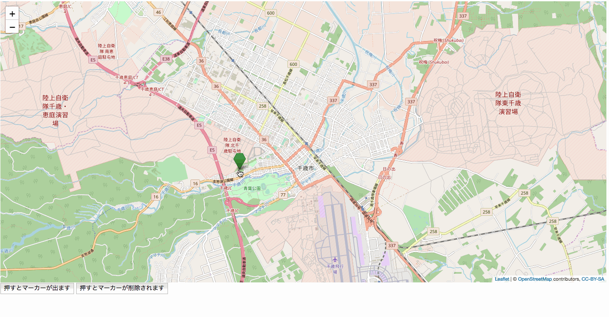

## 9.クリックされた位置にマーカーを表示する

`webapp/js`に作成したmap.jsを以下のように変更

```javascript

var map;
var tileLayer;
var marker;
var markers = [];
var staticLat = 42.828816;
var staticLon = 141.650705;

function drawMap() {
    map = L.map('map').setView([staticLat, staticLon], 13);

    tileLayer = L.tileLayer('https://{s}.tile.openstreetmap.org/{z}/{x}/{y}.png', {
        attribution: '© <a href="http://osm.org/copyright">OpenStreetMap</a> contributors, <a href="http://creativecommons.org/licenses/by-sa/2.0/">CC-BY-SA</a>',
        maxZoom: 19
    });
    tileLayer.addTo(map);
    //追加
    setClickEvent();
}

function setMarker(hukidasi) {
    markers = [];
    for (var i = 0; i < 5; i++) {
        marker = L.marker([staticLat + (i / 150), staticLon + (i / 150)],
            {
                icon: L.ExtraMarkers.icon({
                    icon: 'fa-number',
                    shape: 'penta',
                    prefix: 'fa',
                    markerColor: 'green',
                    number: i + 1,
                })
            }).addTo(map).bindPopup(hukidasi);
        markers.push(marker);
    }
}

//追加
function setClickEvent() {
    map.on("click", function (e) {
        //クリックされた場所の座標を取得
        var latlng = e.latlng;
        //その座標を元にマーカーを作成
        marker = L.marker([latlng.lat, latlng.lng],
            {
                icon: L.ExtraMarkers.icon({
                    icon: 'fa-number',
                    shape: 'penta',
                    prefix: 'fa',
                    markerColor: 'green',
                })
            }).addTo(map);
        markers.push(marker);
    });


}

function deleteMarker() {
    //変更
    for (var i = 0; i < markers.length; i++) {
        map.removeLayer(markers[i]);
    }
}

```

**実行結果**


[ハンズオン10へ](./HandsOn10.md)