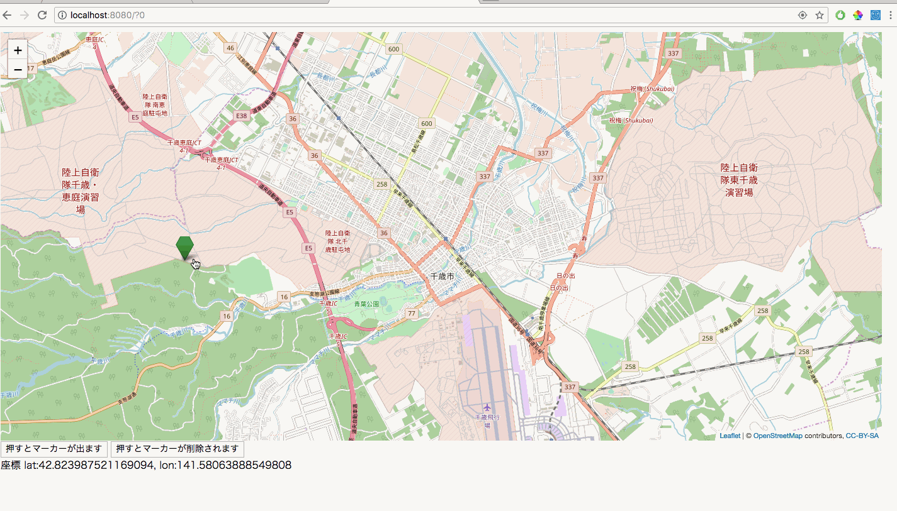

## 11.javascriptからWicketに値を渡す

Ajaxを活用してjavascriptからWicketに値を渡すことができます。
今回は取得された現在地の座標をJava側に渡します。


`webapp/js`に作成したmap.jsを以下のように変更


```javascript
var map;
var tileLayer;
var marker;
var markers = [];
var staticLat = 42.828816;
var staticLon = 141.650705;

function drawMap() {
    map = L.map('map').setView([staticLat, staticLon], 13);

    tileLayer = L.tileLayer('https://{s}.tile.openstreetmap.org/{z}/{x}/{y}.png', {
        attribution: '© <a href="http://osm.org/copyright">OpenStreetMap</a> contributors, <a href="http://creativecommons.org/licenses/by-sa/2.0/">CC-BY-SA</a>',
        maxZoom: 19
    });
    tileLayer.addTo(map);
    setClickEvent();
    setCurrentLocationMarker();
}

function setMarker(hukidasi) {
    markers = [];
    for (var i = 0; i < 5; i++) {
        marker = L.marker([staticLat + (i / 150), staticLon + (i / 150)],
            {
                icon: L.ExtraMarkers.icon({
                    icon: 'fa-number',
                    shape: 'penta',
                    prefix: 'fa',
                    markerColor: 'green',
                    number: i + 1,
                })
            }).addTo(map).bindPopup(hukidasi);
        markers.push(marker);
    }
}

function setClickEvent() {
    map.on("click", function (e) {
        //クリックされた場所の座標を取得
        var latlng = e.latlng;
        //その座標を元にマーカーを作成
        marker = L.marker([latlng.lat, latlng.lng],
            {
                icon: L.ExtraMarkers.icon({
                    icon: 'fa-number',
                    shape: 'penta',
                    prefix: 'fa',
                    markerColor: 'green',
                })
            }).addTo(map);
        markers.push(marker);
        //追加
        //javascriptとJavaでやり取りをするための関数(javascript側で関数の定義や処理は書かない)
        //Java側で呼び出されて引数がそのままJavaに渡される
        sendLatLon(latlng.lat,latlng.lng);
    });


}

function deleteMarker() {
    for (var i = 0; i < markers.length; i++) {
        map.removeLayer(markers[i]);
    }
}

function setCurrentLocationMarker() {
    //GeolocationAPIのgetCurrentPosition関数を使って現在地を取得
    navigator.geolocation.getCurrentPosition(function (currentPosition) {
        var lat = currentPosition.coords.latitude;
        var lon = currentPosition.coords.longitude;

        marker = L.marker([lat, lon], {
            icon: L.ExtraMarkers.icon({
                icon: 'fa-number',
                shape: 'penta',
                prefix: 'fa',
                markerColor: 'green',
            })
        }).addTo(map);
        markers.push(marker);

    }, function (error) {
        console.log(error);
        alert('位置情報が取得できません');
    });
}
```
<<<<<<< Updated upstream
=======
`java/page`に作成したHomePage.javaを以下のように変更

>>>>>>> Stashed changes
```java
import de.agilecoders.wicket.webjars.request.resource.WebjarsCssResourceReference;
import de.agilecoders.wicket.webjars.request.resource.WebjarsJavaScriptResourceReference;
import lombok.val;
import net.arnx.jsonic.JSON;
import org.apache.wicket.Component;
import org.apache.wicket.ajax.AbstractDefaultAjaxBehavior;
import org.apache.wicket.ajax.AjaxRequestTarget;
import org.apache.wicket.ajax.markup.html.AjaxLink;
import org.apache.wicket.markup.head.CssHeaderItem;
import org.apache.wicket.markup.head.IHeaderResponse;
import org.apache.wicket.markup.head.JavaScriptHeaderItem;
import org.apache.wicket.markup.head.OnDomReadyHeaderItem;
import org.apache.wicket.markup.html.WebMarkupContainer;
import org.apache.wicket.markup.html.WebPage;
import org.apache.wicket.markup.html.basic.Label;
import org.apache.wicket.model.IModel;
import org.apache.wicket.model.Model;

import static org.apache.wicket.ajax.attributes.CallbackParameter.explicit;

public class HandsOn11 extends WebPage {

    private static final long serialVersionUID = 5148374236998314569L;

    public HandsOn11(){
        IModel<String> latLngModel = new Model<>();

        add(new AjaxLink<Void>("addMarker") {
            private static final long serialVersionUID = -3557070478203422027L;

            @Override
            public void onClick(AjaxRequestTarget target) {
                target.appendJavaScript("setMarker("+ JSON.encode("吹き出しの中身") +");");
            }
        });

        add(new AjaxLink<Void>("deleteMarker") {
            private static final long serialVersionUID = 6980420161575158161L;

            @Override
            public void onClick(AjaxRequestTarget target) {
                target.appendJavaScript("deleteMarker();");
            }
        });
        
        //追加
        //Java側でLabelなどのコンポーネントをAjaxで書き換えるときは, 書き換えたいコンポーネントを直接更新するのではなく,
        //WMCなどを親コンポーネントとしておき, 子コンポーネントとして書き換えたいコンポーネントを親コンポーネントがaddする.
        //親コンポーネントを更新の対象とすると, addされている子コンポーネントが全て更新されます
        WebMarkupContainer latLngWMC = new WebMarkupContainer("latLngWMC"){

            private static final long serialVersionUID = -2789836514770760188L;

            //onInitializeメソッドはコンポーネントが描画されるタイミングで呼び出される
            //なのでコンポーネントの初期状態を管理したいときに使う
            //似たようなものとしてonConfigureメソッドがあり, コンポーネントが更新されたときに毎回呼び出される
            @Override
            protected void onInitialize() {
                super.onInitialize();
                //コンポーネントをAjaxで更新可能にする処理
                setOutputMarkupId(true);
            }
        };
        add(latLngWMC);
        //追加
        //座標を表示するLabel
        latLngWMC.add(new Label(latlon, latLngModel));

        add(new AbstractDefaultAjaxBehavior() {
            private static final long serialVersionUID = -488243388522526746L;

            @Override
            public void renderHead(Component component, IHeaderResponse response) {
                super.renderHead(component, response);
                //explicitに渡すパラメーター名は必ずPARAM_で始まる必要がある
                val function = getCallbackFunction(explicit("PARAM_lat"),explicit("PARAM_lon"));
                val js = "sendLatLon = " + function.toString();
                response.render(OnDomReadyHeaderItem.forScript(js));
            }

            @Override
            protected void respond(AjaxRequestTarget target) {
                //renderHeadメソッドで使ったパラメーター名を元に値を取り出す
                val latitude = getRequest().getRequestParameters().getParameterValue("PARAM_lat").toDouble(0d);
                val longitude = getRequest().getRequestParameters().getParameterValue("PARAM_lon").toDouble(0d);
                latLngModel.setObject("lat:" + latitude + ", lon:" + longitude);
                target.add(latLngWMC);
            }
        });
    }

    @Override
    public void renderHead(IHeaderResponse response) {
        super.renderHead(response);
        response.render(JavaScriptHeaderItem.forReference(getApplication().getJavaScriptLibrarySettings().getJQueryReference()));
        response.render(JavaScriptHeaderItem.forReference(new WebjarsJavaScriptResourceReference("./leaflet/current/dist/leaflet.js")));
        response.render(CssHeaderItem.forReference(new WebjarsCssResourceReference("./leaflet/current/dist/leaflet.css")));
        response.render(JavaScriptHeaderItem.forUrl("./js/leaflet.extra-markers.min.js"));
        response.render(CssHeaderItem.forUrl("./css/leaflet.extra-markers.min.css"));
        response.render(JavaScriptHeaderItem.forUrl("./answer/HandsOn11.js"));
        response.render(OnDomReadyHeaderItem.forScript("drawMap();"));
    }
}
```

`java/page`に作成したHomePage.htmlを以下のように変更

```html
<!DOCTYPE  html>
<html xmlns:wicket="http:/wicket.apache.org">
<head>
    <meta charset="UTF-8"/>
    <title>HandsOn11</title>
</head>
<body>
<div style="width: 1400px;height: 650px;" id="map"></div>
<button type="submit" style="font-size: 14px;" wicket:id="addMarker">押すとマーカーが出ます</button>
<button type="submit" style="font-size: 14px;" wicket:id="deleteMarker">押すとマーカーが削除されます</button>
<!-- 追加 -->
<div wicket:id="latLngWMC">
    座標&nbsp;<label wicket:id="latlon"></label>
</div>

</body>
</html>

```

**実行結果**
  

[ハンズオン12へ](./HandsOn12.md)
