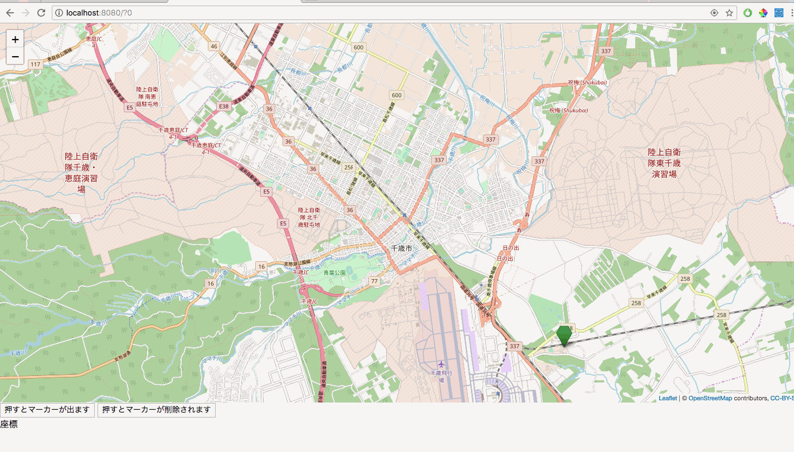

## responsiveな地図にする
ここまでのHandsOnで作成した地図はresponsiveではなく固定サイズでした。
leaflet.jsで作成する地図はheightをvh、widthをvwという単位でサイズ指定することでresponsiveな地図にすることができます。  
vh、vwという単位は[viewport](https://qiita.com/ryounagaoka/items/045b2808a5ed43f96607)に対する割合を指定するものです。
80vhと書いた場合viewportの8割の高さ、80vwと書いた場合はviewportの8割の横幅というようになります。

`java/page`に作成したHomePage.htmlを以下のように変更

```html
<!DOCTYPE  html>
<html xmlns:wicket="http:/wicket.apache.org">
<head>
    <meta charset="UTF-8"/>
    <!-- 追加 -->
    <meta name="viewport" content="width=device-width, initial-scale=1.0, maximum-scale=1.0, user-scalable=no"/>
    <title>HandsOn12</title>
</head>
<!-- 追加 -->
<!-- 本当はcsvファイルに分けたほうがいいです。今回はこのページでしか使わないのでこうしています -->
<style>
    body {
        padding: 0;
        margin: 0;
    }

    html, body {
        height: 100%;
        width: 100vw;
    }

    #map {
        height: 85%;
        width: 100vw;
    }
</style>
<body>
<!-- 変更 styleを削除 -->
<div id="map"></div>
<button type="submit" style="font-size: 14px;" wicket:id="addMarker">押すとマーカーが出ます</button>
<button type="submit" style="font-size: 14px;" wicket:id="deleteMarker">押すとマーカーが削除されます</button>
<div wicket:id="latLngWMC">
    座標&nbsp;<label wicket:id="latlon"></label>
</div>

</body>
</html>

```

**実行結果**


<!-- [ハンズオン13へ](./HandsOn13.md) -->