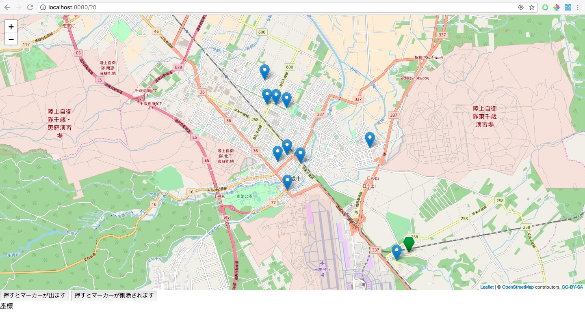

## DBから取り出した座標の値を元にマーカーをセットする
これまでは、クリックした位置などにマーカーをセットしていました。  
今回はDBから持ってきた座標をもとにマーカーをセットします。  

まずDBを動かすための設定フォルダを作成します。  
`java`パッケージ内に`answer.repository`パッケージ、`answer.service`パッケージ、`answer.dao`パッケージを作成してください。  

次に`resources`パッケージ内に`hikari.properties`ファイルを作成してください。  
その後[hikari.properties](/src/main/resources/hikari.properties)の中身を`hikari.properties`にコピペしてください。

次に`answer.repository`パッケージ内に`IDBCP`インターフェースと`DBCP`クラスを作成してください。  
その後[IDBCP](/src/main/java/answer/repository/IDBCP.java)と[DBCP](/src/main/java/answer/repository/DBCP.java)の中身をそれぞれコピペしてください。

次に`java`パッケージ内に`answer.Bean`パッケージを作成し、`ContributionBean`クラスを作成し内容は以下のようにしてください。

```java
package Bean;

import lombok.AllArgsConstructor;
import lombok.Data;
import org.postgresql.geometric.PGcircle;

import java.io.Serializable;
import java.time.LocalDateTime;

//Dataアノテーションをつけると自動でgetter,setterが生成される
@Data
//AllArgsConstructorをつけると自動で全てのクラス変数を引数にしたコンストラクターが生成される
@AllArgsConstructor
public class ContributionBean implements Serializable {
    private static final long serialVersionUID = -1649654287922384729L;

    //PGcircle型はpostgresのcircle型をJava上で扱うための型です
    //PGcircle型は緯度,軽度,その緯度軽度を中心にした円の半径で構成されます
    private PGcircle latlon;
    private LocalDateTime postTime;

    public ContributionBean(){

        this.latlon = new PGcircle(0d,0d,0);
        this.postTime = LocalDateTime.MIN;
    }

}
```

次に`dao`パッケージ内に`AbstractDAO`クラスと`IContributionDAO`インターフェースと`ContributionDAO`クラスを作成してください。
その後[AbstractDAO](/src/main/java/answer/dao/AbstractDAO.java)の中身を`AbstractDAO`にコピーしてください。

`IContributionDAO`インターフェースの内容は以下のようにしてください。
```java
package dao;

import Bean.ContributionBean;
import com.google.inject.ImplementedBy;

import java.util.List;

//とりあえずおまじない
//気になる人はgoogle juiceとかDIコンテナとかでググってください
@ImplementedBy(ContributionDAO.class)
public interface IContributionDAO {
    List<ContributionBean> selectContributionList();
}
```

`ContributionDAO`クラスの内容は以下のようにしてください。
```java
package dao;

import answer.Bean.ContributionBean;
import lombok.extern.slf4j.Slf4j;
import org.sql2o.Connection;
import java.sql.SQLException;
import java.util.List;

//https://kiririmode.hatenablog.jp/entry/20150526/1432625055 参考URL
@Slf4j
public class ContributionDAO extends AbstractDAO implements IContributionDAO {
    @Override
    public List<ContributionBean> selectContributionList() {
        List<ContributionBean> contributionBeanList = null;
        String sql = "select latlon, post_time from contribution where available = 'true'";
        try(Connection conn = dbcp.getSql2o().open()){
            contributionBeanList = conn.createQuery(sql)
                    .setAutoDeriveColumnNames(true)//Beanの変数名とDBのカラム名をキャメルケースとスネークケースの差を吸収してマッピングしてくれる
                    .executeAndFetch(ContributionBean.class);//基本データ型(int, floatとか)以外の任意の型のListでsqlの結果が返ってくる時はexecuteAndFetch(型名.class)を使う
                                                             //他にもいろいろあるのでsql2oでググって調べてみてください
        } catch (SQLException e) {
            e.printStackTrace();
        }

        return contributionBeanList;
    }
}


```

次に`service`パッケージ内に`IContoributionService`インターフェースと`ContoributionService`クラスを作成してください。

`IContributionService`は以下の内容にしてください。
```java

import Bean.ContributionBean;
import com.google.inject.ImplementedBy;

import java.util.List;

@ImplementedBy(ContributionService.class)
public interface IContributionService {
    List<ContributionBean> selectContributionList();
}

```

`ContributionService`は以下の内容にしてください。

```java
import Bean.ContributionBean;
import dao.IContributionDAO;
import com.google.inject.Inject;
import lombok.extern.slf4j.Slf4j;

import java.util.List;


public class ContributionService implements IContributionService{
    @Inject
    private IContributionDAO contributionDAO;

    @Override
    public List<ContributionBean> selectContributionList() {
        return contributionDAO.selectContributionList();
    }
}

```

`webapp/map.js`を以下のように変更してください。

```javascript
var map;
var tileLayer;
var marker;
var markers = [];
var staticLat = 42.828816;
var staticLon = 141.650705;

function drawMap() {
    map = L.map('map').setView([staticLat, staticLon], 13);

    tileLayer = L.tileLayer('https://{s}.tile.openstreetmap.org/{z}/{x}/{y}.png', {
        attribution: '© <a href="http://osm.org/copyright">OpenStreetMap</a> contributors, <a href="http://creativecommons.org/licenses/by-sa/2.0/">CC-BY-SA</a>',
        maxZoom: 19
    });
    tileLayer.addTo(map);
    setClickEvent();
    setCurrentLocationMarker();
}

function setMarker(hukidasi) {
    markers = [];
    for (var i = 0; i < 5; i++) {
        marker = L.marker([staticLat + (i / 150), staticLon + (i / 150)],
            {
                icon: L.ExtraMarkers.icon({
                    icon: 'fa-number',
                    shape: 'penta',
                    prefix: 'fa',
                    markerColor: 'green',
                    number: i + 1,
                })
            }).addTo(map).bindPopup(hukidasi);
        markers.push(marker);
    }
}

function setClickEvent() {
    map.on("click", function (e) {
        //クリックされた場所の座標を取得
        var latlng = e.latlng;
        //その座標を元にマーカーを作成
        marker = L.marker([latlng.lat, latlng.lng],
            {
                icon: L.ExtraMarkers.icon({
                    icon: 'fa-number',
                    shape: 'penta',
                    prefix: 'fa',
                    markerColor: 'green',
                })
            }).addTo(map);
        markers.push(marker);
        sendLatLon(latlng.lat,latlng.lng);
    });

}

function deleteMarker() {
    for (var i = 0; i < markers.length; i++) {
        map.removeLayer(markers[i]);
    }
}

function setCurrentLocationMarker() {
    //GeolocationAPIのgetCurrentPosition関数を使って現在地を取得
    navigator.geolocation.getCurrentPosition(function (currentPosition) {
        var lat = currentPosition.coords.latitude;
        var lon = currentPosition.coords.longitude;

        marker = L.marker([lat, lon], {
            icon: L.ExtraMarkers.icon({
                icon: 'fa-number',
                shape: 'penta',
                prefix: 'fa',
                markerColor: 'green',
            })
        }).addTo(map);
        markers.push(marker);

    }, function (error) {
        console.log(error);
        alert('位置情報が取得できません');
    });
}
//追加
function setContributionMarker(contributionList){
    for(var i = 0;i<contributionList.length; i++){
        //Javaから渡されたBeanを引数で渡された場合は引数名.Beanでの変数名で変数を呼び出すことができる
        marker = L.marker([contributionList[i].latlon.center.y, contributionList[i].latlon.center.x],{}).addTo(map).bindPopup(contributionList[i].postTime);
        markers.push(marker);
    }
}
```

`HomePage.java`を以下の内容に変更してください。
```java
package answer;

import answer.service.IContributionService;
import com.google.inject.Inject;
import de.agilecoders.wicket.webjars.request.resource.WebjarsCssResourceReference;
import de.agilecoders.wicket.webjars.request.resource.WebjarsJavaScriptResourceReference;
import lombok.val;
import net.arnx.jsonic.JSON;
import org.apache.wicket.Component;
import org.apache.wicket.ajax.AbstractDefaultAjaxBehavior;
import org.apache.wicket.ajax.AjaxRequestTarget;
import org.apache.wicket.ajax.markup.html.AjaxLink;
import org.apache.wicket.markup.head.CssHeaderItem;
import org.apache.wicket.markup.head.IHeaderResponse;
import org.apache.wicket.markup.head.JavaScriptHeaderItem;
import org.apache.wicket.markup.head.OnDomReadyHeaderItem;
import org.apache.wicket.markup.html.WebMarkupContainer;
import org.apache.wicket.markup.html.WebPage;
import org.apache.wicket.markup.html.basic.Label;
import org.apache.wicket.model.IModel;
import org.apache.wicket.model.Model;

import static org.apache.wicket.ajax.attributes.CallbackParameter.explicit;

public class HandsOn13 extends WebPage {
    private static final long serialVersionUID = 2947674758440633002L;

    //これもgoogle juiceやDIコンテナで調べると出てくるキーワードです
    @Inject
    private IContributionService contributionService;

    public HandsOn13(){
        IModel<String> latLngModel = new Model<>();

        add(new AjaxLink<Void>("addMarker") {
            private static final long serialVersionUID = -3557070478203422027L;

            @Override
            public void onClick(AjaxRequestTarget target) {
                target.appendJavaScript("setMarker("+ JSON.encode("吹き出しの中身") +");");
            }
        });

        add(new AjaxLink<Void>("deleteMarker") {
            private static final long serialVersionUID = 6980420161575158161L;

            @Override
            public void onClick(AjaxRequestTarget target) {
                target.appendJavaScript("deleteMarker();");
            }
        });

        WebMarkupContainer latLngWMC = new WebMarkupContainer("latLngWMC"){

            private static final long serialVersionUID = -2789836514770760188L;

            @Override
            protected void onInitialize() {
                super.onInitialize();
                setOutputMarkupId(true);
            }
        };
        add(latLngWMC);
        latLngWMC.add(new Label("latLng", latLngModel));

        add(new AbstractDefaultAjaxBehavior() {
            private static final long serialVersionUID = -488243388522526746L;

            @Override
            public void renderHead(Component component, IHeaderResponse response) {
                super.renderHead(component, response);
                val function = getCallbackFunction(explicit("PARAM_lat"),explicit("PARAM_lon"));
                val js = "sendLatLon = " + function.toString();
                response.render(OnDomReadyHeaderItem.forScript(js));
            }

            @Override
            protected void respond(AjaxRequestTarget target) {
                val latitude = getRequest().getRequestParameters().getParameterValue("PARAM_lat").toDouble(0d);
                val longitude = getRequest().getRequestParameters().getParameterValue("PARAM_lon").toDouble(0d);
                latLngModel.setObject("lat:" + latitude + ", lon:" + longitude);
                target.add(latLngWMC);
            }
        });
    }
 
    @Override
    public void renderHead(IHeaderResponse response) {
        super.renderHead(response);
        response.render(JavaScriptHeaderItem.forReference(getApplication().getJavaScriptLibrarySettings().getJQueryReference()));
        response.render(JavaScriptHeaderItem.forReference(new WebjarsJavaScriptResourceReference("./leaflet/current/dist/leaflet.js")));
        response.render(CssHeaderItem.forReference(new WebjarsCssResourceReference("./leaflet/current/dist/leaflet.css")));
        response.render(JavaScriptHeaderItem.forUrl("./js/leaflet.extra-markers.min.js"));
        response.render(CssHeaderItem.forUrl("./css/leaflet.extra-markers.min.css"));
        response.render(JavaScriptHeaderItem.forUrl("./answer/map.js"));
        response.render(OnDomReadyHeaderItem.forScript("drawMap();"));
        //追加
        response.render(OnDomReadyHeaderItem.forScript("setContributionMarker("+ JSON.encode(contributionService.selectContributionList()) +");"));
    }
}
```

**実行結果**


[ハンズオン14へ](./HandsOn14.md)
