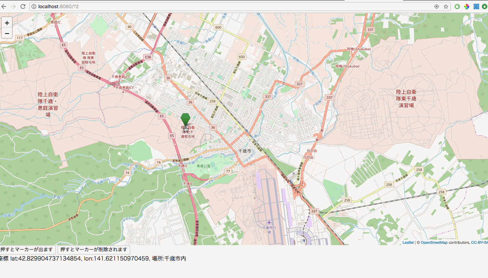

## マーカーがある範囲内に収まっているか判定する

千歳市の範囲内に収まっているかを判定します。この処理は実際に道路管理課で実証実験をしたシステムでも行なっている処理です。
[chitoseArea.json]()をダウンロードして`webapp/js`以下においてください。

次に、`webapp/js`以下のmap.jsを以下のように変更して下さい。
```javascript
var map;
var tileLayer;
var marker;
var markers = [];
var staticLat = 42.828816;
var staticLon = 141.650705;
//以下の3つを追加
var isChitose;
var checkBounds;
var edgeRect;

function drawMap() {
    map = L.map('map').setView([staticLat, staticLon], 13);

    tileLayer = L.tileLayer('https://{s}.tile.openstreetmap.org/{z}/{x}/{y}.png', {
        attribution: '© <a href="http://osm.org/copyright">OpenStreetMap</a> contributors, <a href="http://creativecommons.org/licenses/by-sa/2.0/">CC-BY-SA</a>',
        maxZoom: 19
    });
    tileLayer.addTo(map);
    setClickEvent();
    setCurrentLocationMarker();
}

function setMarker(hukidasi) {
    markers = [];
    for (var i = 0; i < 5; i++) {
        marker = L.marker([staticLat + (i / 150), staticLon + (i / 150)],
            {
                icon: L.ExtraMarkers.icon({
                    icon: 'fa-number',
                    shape: 'penta',
                    prefix: 'fa',
                    markerColor: 'green',
                    number: i + 1,
                })
            }).addTo(map).bindPopup(hukidasi);
        markers.push(marker);
    }
}

function setClickEvent() {
    map.on("click", function (e) {
        //クリックされた場所の座標を取得
        var latlng = e.latlng;
        //変更
        isChitoseLatlon(latlng);
        if (isChitose) {
            // その座標を元にマーカーを作成
            marker = L.marker([latlng.lat, latlng.lng],
                {
                    icon: L.ExtraMarkers.icon({
                        icon: 'fa-number',
                        shape: 'penta',
                        prefix: 'fa',
                        markerColor: 'green',
                    })
                }).addTo(map);
            markers.push(marker);
            sendLatLon(latlng.lat, latlng.lng, "千歳市内");
        } else {
            sendLatLon(latlng.lat, latlng.lng, "千歳市外");
        }
    });

}

function deleteMarker() {
    for (var i = 0; i < markers.length; i++) {
        map.removeLayer(markers[i]);
    }
}

function setCurrentLocationMarker() {
    //GeolocationAPIのgetCurrentPosition関数を使って現在地を取得
    navigator.geolocation.getCurrentPosition(function (currentPosition) {
        var lat = currentPosition.coords.latitude;
        var lon = currentPosition.coords.longitude;

        marker = L.marker([lat, lon], {
            icon: L.ExtraMarkers.icon({
                icon: 'fa-number',
                shape: 'penta',
                prefix: 'fa',
                markerColor: 'green',
            })
        }).addTo(map);
        markers.push(marker);

    }, function (error) {
        console.log(error);
        alert('位置情報が取得できません');
    });
}

function setContributionMarker(contributionList) {
    for (var i = 0; i < contributionList.length; i++) {
        //Javaから渡されたBeanを引数で渡された場合は引数名.Beanでの変数名で変数を呼び出すことができる
        marker = L.marker([contributionList[i].latlon.center.y, contributionList[i].latlon.center.x], {}).addTo(map).bindPopup(contributionList[i].postTime);
        markers.push(marker);
    }
}
//追加
function isChitoseLatlon(latlng) {
    $.ajax({
        url: './../js/chitoseArea.json',
        dataType: 'json',
        async: false,
        success: function (json) {
            edgeRect = L.polyline(json.edgeLatlon);
            checkBounds = edgeRect.getBounds();
            isChitose = checkBounds.contains(latlng);
        }
    });
}
```

次に、`java/HomePage.java`を以下のように変更してください
```java
package answer;

import answer.service.IContributionService;
import com.google.inject.Inject;
import de.agilecoders.wicket.webjars.request.resource.WebjarsCssResourceReference;
import de.agilecoders.wicket.webjars.request.resource.WebjarsJavaScriptResourceReference;
import lombok.val;
import net.arnx.jsonic.JSON;
import org.apache.wicket.Component;
import org.apache.wicket.ajax.AbstractDefaultAjaxBehavior;
import org.apache.wicket.ajax.AjaxRequestTarget;
import org.apache.wicket.ajax.markup.html.AjaxLink;
import org.apache.wicket.markup.head.CssHeaderItem;
import org.apache.wicket.markup.head.IHeaderResponse;
import org.apache.wicket.markup.head.JavaScriptHeaderItem;
import org.apache.wicket.markup.head.OnDomReadyHeaderItem;
import org.apache.wicket.markup.html.WebMarkupContainer;
import org.apache.wicket.markup.html.WebPage;
import org.apache.wicket.markup.html.basic.Label;
import org.apache.wicket.model.IModel;
import org.apache.wicket.model.Model;

import static org.apache.wicket.ajax.attributes.CallbackParameter.explicit;

public class HandsOn14 extends WebPage {
    private static final long serialVersionUID = 2947674758440633002L;

    @Inject
    private IContributionService contributionService;

    public HandsOn14(){
        IModel<String> latLngModel = new Model<>();

        add(new AjaxLink<Void>("addMarker") {
            private static final long serialVersionUID = -3557070478203422027L;

            @Override
            public void onClick(AjaxRequestTarget target) {
                target.appendJavaScript("setMarker("+ JSON.encode("吹き出しの中身") +");");
            }
        });

        add(new AjaxLink<Void>("deleteMarker") {
            private static final long serialVersionUID = 6980420161575158161L;

            @Override
            public void onClick(AjaxRequestTarget target) {
                target.appendJavaScript("deleteMarker();");
            }
        });

        WebMarkupContainer latLngWMC = new WebMarkupContainer("latLngWMC"){

            private static final long serialVersionUID = -2789836514770760188L;

            @Override
            protected void onInitialize() {
                super.onInitialize();
                setOutputMarkupId(true);
            }
        };
        add(latLngWMC);
        latLngWMC.add(new Label("latLng", latLngModel));

        //変更 PARAMを追加
        add(new AbstractDefaultAjaxBehavior() {
            private static final long serialVersionUID = -488243388522526746L;

            @Override
            public void renderHead(Component component, IHeaderResponse response) {
                super.renderHead(component, response);
                val function = getCallbackFunction(explicit("PARAM_lat"),explicit("PARAM_lon"),explicit("PARAM_isChitose"));
                val js = "sendLatLon = " + function.toString();
                response.render(OnDomReadyHeaderItem.forScript(js));
            }

            @Override
            protected void respond(AjaxRequestTarget target) {
                val latitude = getRequest().getRequestParameters().getParameterValue("PARAM_lat").toDouble(0d);
                val longitude = getRequest().getRequestParameters().getParameterValue("PARAM_lon").toDouble(0d);
                val description = getRequest().getRequestParameters().getParameterValue("PARAM_isChitose").toString("");
                latLngModel.setObject("lat:" + latitude + ", lon:" + longitude + ", 場所:" + description);
                target.add(latLngWMC);
            }
        });
    }

    @Override
    public void renderHead(IHeaderResponse response) {
        super.renderHead(response);
        response.render(JavaScriptHeaderItem.forReference(getApplication().getJavaScriptLibrarySettings().getJQueryReference()));
        response.render(JavaScriptHeaderItem.forReference(new WebjarsJavaScriptResourceReference("./leaflet/current/dist/leaflet.js")));
        response.render(CssHeaderItem.forReference(new WebjarsCssResourceReference("./leaflet/current/dist/leaflet.css")));
        response.render(JavaScriptHeaderItem.forUrl("./js/leaflet.extra-markers.min.js"));
        response.render(CssHeaderItem.forUrl("./css/leaflet.extra-markers.min.css"));
        response.render(JavaScriptHeaderItem.forUrl("./answer/HandsOn14.js"));
        response.render(OnDomReadyHeaderItem.forScript("drawMap();"));
        //今回はクリックしてセットしたマーカーに対して千歳市内に収まっているかを判定したいので一旦コメントアウト
        //response.render(OnDomReadyHeaderItem.forScript("setContributionMarker("+ JSON.encode(contributionService.selectContributionList()) +");"));
    }
}
```

**実行結果**

